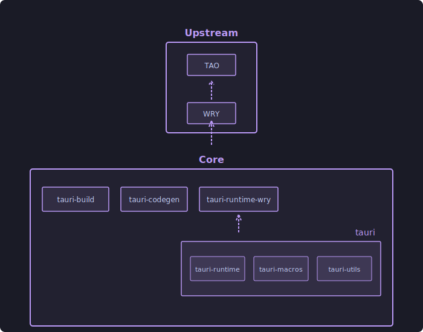
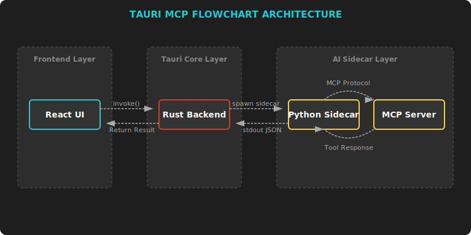

# [KIẾN TRÚC](https://v2.tauri.app/concept/architecture/) CỦA TAURI

### Cơ chế giao tiếp "The Bright" (Cầu nối)

|Chiều giao tiếp|Cơ chế|Giải thích|
|:-|:-|:-|
|`Frontend → Backend`|Commands|Frontend gọi một hàm Rust (ví dụ: invoke('greet')). Lớp tauri-codegen và tauri-runtime sẽ chuyển yêu cầu này xuống Rust.|
|`Backend → Frontend`|Events|Rust gửi một sự kiện (Event) lên Frontend. tauri-runtime-wry sẽ đẩy thông tin qua WebView để JavaScript bắt được.|

### Nguyên tắc bảo mật tối đa

>Cách ly: *Frontend chạy trong môi trường bị giới hạn. Nó không thể tự ý xóa file trên ổ cứng của bạn.*

>Kiểm soát: *Muốn làm gì đó liên quan đến hệ thống, Frontend phải "xin phép" Backend thông qua các Command đã được lập trình viên định nghĩa sẵn trong tầng tauri-runtime.*

>Hiệu năng: *Tầng Upstream (TAO/WRY) giúp ứng dụng tận dụng tối đa tài nguyên sẵn có của hệ điều hành mà không cần gánh thêm một bộ engine nặng nề.*

# KIẾN TRÚC TỔNG THỂ ỨNG DỤNG

## Phân tầng ứng dụng

*Tauri(React UI + Rust Orchestrator) với Sidecar Python Backend*

Tầng **Giao diện ((Presentation Layer / Frontend))**: *Đây là lớp vỏ mà người dùng tương tác trực tiếp.*  

Tầng **Điều phối trung tâm (Orchestration Layer / Tauri Core)**: *Đây là "bộ não" điều khiển ứng dụng, nơi Rust ngự trị.*

Tầng **Nghiệp vụ Gốc (Core Logic Layer / Python Backend)**: *Đây là nơi chứa "trí thông minh" thực sự của ứng dụng*

# LUỒNG DỮ LIỆU (DATA FLOW)

## Các phương thức lưu trữ dữ liệu

| Đặc tính         | **Tauri Store**                                       | **Environment Variables**                 | **DBMS**                         |
| :--------------- | :---------------------------------------------------- | :---------------------------------------- | :----------------------------------------- |
| **Bản chất**     | Persistent File (JSON/Binary) trên ổ cứng             | In-memory Key-Value trong bộ nhớ RAM      | Hệ quản trị CSDL |
| **Persistence**  | **Vĩnh viễn:** Duy trì sau khi khởi động lại/cập nhật | **Tạm thời:** Mất khi tiến trình kết thúc | **Vĩnh viễn:** Chuyên dụng cho dữ liệu lớn |
| **Mục đích**     | Lưu User Preferences (Theme, Settings)                | Inject cấu hình từ App xuống Sidecar      | Lưu nghiệp vụ, Chat History, Embeddings    |
| **Khả năng ghi** | Read/Write linh hoạt trong runtime                    | Read-only (phần lớn) sau khi khởi chạy    | Full CRUD với tính toàn vẹn (ACID)         |
| **Bảo mật**      | Trung bình (Dễ truy cập file hệ thống)                | Cao (Không để lại dấu vết vật lý)         | Cao (Hỗ trợ mã hóa Encryption-at-rest)     |

---

## Nguyên tắc thiết kế & Quyết định lưu trữ

### Tauri Store

Đóng vai trò là tầng lưu trữ cấu hình nhẹ cho các trạng thái cá nhân hóa:

- **UI State:** Theme, ngôn ngữ, kích thước cửa sổ ứng dụng.
- **Credentials:** Quản lý API Keys (Khuyến nghị mã hóa trước khi lưu).
- **Flags:** Feature flags hoặc trạng thái hoàn thành Onboarding.

### Environment Variables

Sử dụng như một kênh truyền dẫn cấu hình an toàn giữa các lớp thực thi:

- **Inter-process Context:** Truyền `PORT` hoặc `SESSION_TOKEN` từ Rust Core xuống Sidecar.
- **Service Endpoint:** Định nghĩa Base URL cho các Model Provider (OpenAI, Anthropic).
- **Environment Context:** Các tham số Build-time hoặc Debug mode.

### DBMS (Database Management System)

Tầng dữ liệu bền vững phục vụ các tác vụ xử lý thông tin phức tạp:

- **Structured Data:** Lịch sử hội thoại, quản lý Workspaces và Logs hoạt động.
- **AI Memory (RAG):** Lưu trữ Vector Embeddings phục vụ truy xuất tri thức cục bộ.

## Phân tầng dữ liệu theo kiến trúc Agent

Kiến trúc phân lớp giúp cô lập trách nhiệm của từng thành phần trong hệ thống Multi-Agent:

| Tầng Kiến Trúc    | Thành Phần       | Loại Dữ Liệu     | Cơ Chế Lưu Trữ Đề Xuất                       |
| :---------------- | :--------------- | :--------------- | :------------------------------------------- |
| **Presentation**  | Frontend (React) | UI State         | `React State`                                |
| **Orchestration** | Rust Core        | App Config       | `Tauri Store`                                |
| **Execution**     | Python Sidecar   | Agent Config     | `Environment Variables`                      |
| **Intelligence**  | AI Memory        | Knowledge/Vector | `DBMS: PostgreSQL` + `VectorBD: ChromaBD` |

