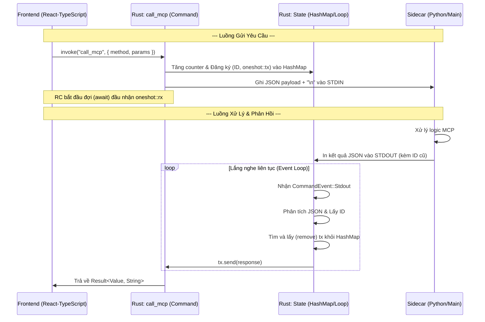

# src-tauri\src\lib.rs

## Định nghĩa Cấu trúc dữ liệu

    #[derive(Serialize)]
    struct JsonRpcRequest {
        jsonrpc: String,
        method: String,
        params: serde_json::Value,
        id: u64,
    }

    struct MCPState {
        child: Arc<Mutex<Option<CommandChild>>>,
        pending_requests: Arc<Mutex<HashMap<u64, oneshot::Sender<serde_json::Value>>>>,
        request_counter: Arc<Mutex<u64>>,
    }

`JsonRpcRequest`: Định nghĩa định dạng gói tin theo chuẩn [JSON-RPC 2.0](https://www.jsonrpc.org/specification). Mọi giao tiếp với MCP Server phải tuân thủ cấu trúc này (có id, method, params).

`MCPState`: Đây là nơi lưu trữ "trạng thái" của ứng dụng:

- `child`: Giữ kết nối với file thực thi đang chạy ngầm.

- `pending_requests`: Một "cuốn sổ cái" ghi lại những yêu cầu đang chờ phản hồi. Khi gửi đi một câu hỏi với id=1, nó sẽ đợi ở đây cho đến khi server trả về câu trả lời cho id=1.

- `request_counter`: Bộ đếm số thứ tự tin nhắn để đảm bảo mỗi tin nhắn có một id duy nhất.

## **Hàm call_mcp()**
*Cầu nối Frontend -> Backend*
```python
#[tauri::command]
async fn call_mcp(
    state: State<'_, MCPState>,
    method: String,
    params: serde_json::Value,
) -> Result<serde_json::Value, String> {
    let id = {
        let mut counter = state.request_counter.lock().await;
        *counter += 1;
        *counter
    };

    let (tx, rx) = oneshot::channel();
    state.pending_requests.lock().await.insert(id, tx);

    let request = JsonRpcRequest {
        jsonrpc: "2.0".to_string(),
        method,
        params,
        id,
    };

    let payload = serde_json::to_string(&request).map_err(|e| e.to_string())?;
    
    let mut child_lock = state.child.lock().await;
    if let Some(child) = child_lock.as_mut() {
        // Gửi payload kèm xuống dòng
        if let Err(e) = child.write(format!("{}\n", payload).as_bytes()) {
            state.pending_requests.lock().await.remove(&id);
            return Err(format!("Lỗi ghi: {}. Kiểm tra log Python!", e));
        }
    } else {
        return Err("MCP Server chưa khởi động".into());
    }
    drop(child_lock);

    match tokio::time::timeout(std::time::Duration::from_secs(15), rx).await {
        Ok(Ok(res)) => Ok(res),
        Ok(Err(_)) => Err("Kết nối bị đóng".to_string()),
        Err(_) => {
            state.pending_requests.lock().await.remove(&id);
            Err("Timeout - Server không phản hồi".to_string())
        },
    }
}
```

*Đây là một Tauri Command, có thể gọi nó từ JavaScript bằng lệnh invoke('call_mcp', { ... }).*

**Tạo ID và Đăng ký**: 
- Nó tạo một id mới, sau đó tạo một "kênh liên lạc" (oneshot::channel). 
- Đầu gửi (tx) được cất vào pending_requests, còn đầu nhận (rx) được dùng để đợi kết quả.

**Gửi dữ liệu**: 
- Nó chuyển yêu cầu thành chuỗi JSON và ghi (write) vào cổng đầu vào (stdin) của file main (sidecar).

**Cơ chế Timeout**:

    tokio::time::timeout(std::time::Duration::from_secs(15), rx).await

>Nếu sau 15 giây mà server không trả lời, nó sẽ tự hủy yêu cầu và báo lỗi "Timeout" để ứng dụng không bị treo vĩnh viễn.

## **Hàm run()**
*Trạm điều khiển trung tâm*

**Khởi tạo vùng nhớ chung (Shared State)**

    let child_arc = Arc::new(Mutex::new(None));
    let pending_requests = Arc::new(Mutex::new(HashMap::new()));

- `Arc (Atomic Reference Counting)`: Vì ứng dụng Tauri chạy đa luồng, Arc giúp các luồng khác nhau cùng sở hữu một dữ liệu mà không làm "vi phạm" quy tắc quản lý bộ nhớ của Rust.

- `Mutex (Mutual Exclusion)`: Đảm bảo tại một thời điểm chỉ có một luồng được phép thay đổi dữ liệu bên trong (như thêm yêu cầu mới hoặc ghi dữ liệu vào sidecar).

- `pending_requests`: Giống như một cái bảng ghim. Khi bạn gửi câu hỏi đi, bạn ghim một cái tem (id) kèm theo cách để liên lạc lại với bạn (oneshot::Sender).

**Đăng ký với Tauri Builder**

    tauri::Builder::default()
        .plugin(tauri_plugin_shell::init())
        .manage(MCPState { ... })

`.plugin(...)`: Kích hoạt plugin "shell" để app có quyền can thiệp vào hệ thống (chạy file thực thi).

`.manage(...)`: Đưa MCPState vào hệ thống quản lý của Tauri. Sau này, bất kỳ hàm #[tauri::command] nào cũng có thể lấy trạng thái này ra dùng bằng cách khai báo state: State<'_, MCPState>.

**Thiết lập Sidecar trong .setup()**

    let sidecar_command = app.shell().sidecar("main").expect("...");
    let (mut rx, mut child) = sidecar_command.spawn().expect("...");

- App tìm file main và chạy nó thành một tiến trình con.
- rx: Cổng để nhận dữ liệu từ server (Stdout).
- child: Đối tượng đại diện cho server để ta có thể ghi dữ liệu xuống (Stdin).

>Thực hiện gửi gói tin JSON khởi tạo để chạy MCP Server

    let init_msg = r#"{"jsonrpc":"2.0", ... "method":"initialize", ...}"#;
    let _ = child.write(format!("{}\n", init_msg).as_bytes());

Lưu trữ tiến trình

    tauri::async_runtime::spawn(async move {
        *child_arc_for_setup.lock().await = Some(child);
    });

*Vì child được tạo ra trong setup, ta phải dùng spawn để đưa nó vào child_arc nhằm giúp hàm call_mcp có thể lấy ra sử dụng sau này.*

**Vòng lắp lắng nghe phản hồi**
`while let Some(event) = rx.recv().await` là một vòng lặp vô tận chạy ngầm:
- **Bắt sự kiện (Stdout)**: Mỗi khi server (Python) in ra một dòng JSON.
- **Phân tích (Parse)**: Chuyển chuỗi văn bản thành dữ liệu serde_json::Value.
- **Khớp ID**:
    - Nó kiểm tra id trong gói tin trả về.
    - Nếu id != 0 (nghĩa là không phải phản hồi của bước chào hỏi), nó sẽ tìm trong bảng ghim pending_requests.
- **Phản hồi về Frontend**:
    - `tx.send(response)`: Lệnh này "bắn" kết quả thẳng về hàm `call_mcp` đang đợi. Sau khi gửi xong, yêu cầu đó cũng bị xóa khỏi bảng ghim để giải phóng bộ nhớ.

