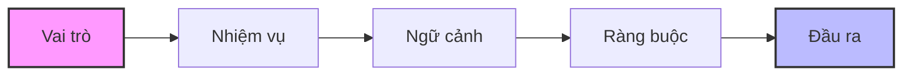

# HƯỚNG DẪN KỸ THUẬT THIẾT KẾ PROMPT

*Tài liệu này hệ thống hóa cách xây dựng lời nhắc (Prompt) tối ưu cho AI dựa trên cấu trúc logic và các công thức diễn đạt thực tế.*

---

## I. Cấu trúc Prompt (Structure of Prompt)

Cấu trúc quyết định AI phải nghĩ theo hướng nào. LLM thực hiện dự đoán token tiếp theo dữ trên không gian khả dĩ (solution space). Cấu trúc prompt là thứ giúp định hình không gian suy nghĩ đó.

Quy trình tư duy để tạo ra một Prompt hoàn chỉnh đi theo luồng logic sau:

---
Định tuyến tư duy (Reasoning Path)

    Vai trò --> Mindset
    Nhiệm vụ --> Goal
    Ngữ cảnh --> Mức trừu tượng
    Ràng buộc --> Biên an toàn
    Đầu ra --> Hình dạng kết quả
---
Cấu trúc kích hoạt các kho kiến thức khác nhau có trong model LLM:

| Cấu trúc | Kiến thức kích hoạt |
|:--- | :--- |
| Role: Giảng viên | Sư phạm |
| Role: Architect | Systerm design |
| Task: So sánh | Phân loại |
## II. Công thức Prompt (Formula)

Công thức là cách người thực hiện prompt mã hóa ý định của mình thành ngôn ngữ. Công thức tốt giúp giảm mở hồ, kiểm soát mức hiểu cho model LLM sử dụng

| Công thức | Mức hiểu |
|:--- | :--- |
| "Ngắn gọn" | Mơ hồ |
| "<= 150 từ" | Rõ |
| "Dễ hiểu" | Mơ hồ |
| "Cho người mới, không thuật ngữ" | Rõ |
| "Có sơ đồ" | Khá |
| "Mermaid flowchart" | Rất rõ |

Sử dụng khung định nghĩa dưới đây để đảm bảo không bỏ sót các thành phần quan trọng:

| Thành phần | Ý nghĩa định nghĩa |
| :--- | :--- |
| **[ROLE]** | AI đóng vai ai? |
| **[TASK]** | Cần làm gì? |
| **[CONTEXT]** | Trong bối cảnh nào? |
| **[INPUT]** | Dữ liệu đầu vào (nếu có) |
| **[CONSTRAINT]** | Giới hạn / quy tắc |
| **[OUTPUT]** | Muốn đầu ra như thế nào? |

---

*Mối quan hệ tổng hợp giữa cấu trúc và công thức của prompt có thể hiểu như mối quan hệ giữa bản đồ và tọa độ GPS trong việc định hướng di chuyển. Cấu trúc prompt đóng vai trò như bản đồ, nó xác định hướng tư duy cho AI — tức là AI cần “đi đâu”, cần suy nghĩ theo khung nào, tập trung vào loại vấn đề nào và loại bỏ những hướng suy nghĩ không liên quan. Trong khi đó, công thức prompt giống như tọa độ GPS, nó quyết định độ phân giải của ý định — AI không chỉ biết đi đâu, mà còn biết đi chính xác đến mức nào, cần chi tiết ra sao, theo định dạng nào và trong phạm vi nào. Khi cấu trúc tốt nhưng công thức mơ hồ, AI biết hướng nhưng không biết điểm đến cụ thể; ngược lại, công thức chi tiết nhưng thiếu cấu trúc khiến AI hiểu yêu cầu nhưng lại đi sai hướng. Chỉ khi cấu trúc xác định đúng hướng tư duy và công thức mã hóa ý định đủ rõ, prompt mới trở thành một chỉ dẫn ổn định, nhất quán và có thể lặp lại trong các hệ thống AI và agent.*
### Sự tác động, ảnh hưởng của cấu trúc đến đầu ra kết quả (output)

**Prompt A**

    Đầu ra: Markdown

**Prompt B**

    Đầu ra:
        - Markdown
        - Heading cấp 2
        - Bullet points
        - Mermaid diagram

B cho kết quả ổn định & lặp lại được

## III. Ánh xạ cấu trúc logic sang công thức diễn đạt

Dưới đây là các công thức cụ thể để chuyển đổi tư duy logic thành câu lệnh thực tế:

### 1. Vai trò
> **Công thức:**
> "Bạn là **[chức danh]** chuyên về **[lĩnh vực]**, phục vụ mục tiêu **[x]**."

### 2. Nhiệm vụ
> **Công thức:**
> "Hãy **[động từ chính]** **[đối tượng]** để đạt được **[kết quả mong muốn]**."

### 3. Ngữ cảnh
> **Công thức:**
> 
> **Ngữ cảnh:**
> - **Đối tượng:** …
> - **Mục đích:** …
> - **Kiến thức nền:** …

### 4. Ràng buộc
> [!IMPORTANT]
> Tác động trực tiếp đến chất lượng đầu ra (Output).

> **Công thức:**
> 
> **Yêu cầu:**
> - **Không:** …
> - **Chỉ:** …
> - **Giới hạn:** …

### 5. Đầu ra
> **Công thức:**
> 
> **Đầu ra:**
> - **Định dạng:** …
> - **Cấu trúc:** …

<!-- ---
*Tài liệu được định dạng chuẩn cho hệ thống Documentation.* -->